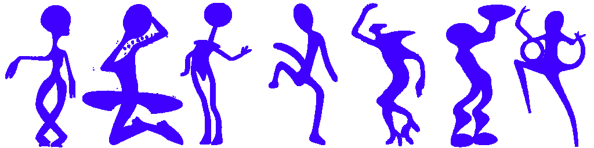

# Terpsichore: Gestural Controller for Artists
Build gesture classification models and integrate them within your artistic workflow within a single GUI application.
Terpsichore lets you record data, train models, and dispatch live inference using [OSC](https://ccrma.stanford.edu/groups/osc/index.html), integrating video-based, gestural classification and data into real time artistic processes.

## Getting Started
- Python 3.11+
- Clone this repository
```
git clone https://github.com/CyWP/Terpsichore.git
```
- Install requirements, or alternatively install them in a [virtual environment](https://docs.python.org/3/library/venv.html#creating-virtual-environments).
```
#Assuming you're in the folder where you cloned the repository
pip install -r requirements.txt
```
- Launch application
```
#In same folder
python -u __init__.py
```

## Overview
Terpsichore's workflow is separated into three stages, more information on each can be found in the Interface section:
- **Data Collection**

Record relevant gesture data to your classification model using a webcam or prerecorded videos.
- **Model Training**

Train a classification model with your recorded gesture data.
- **Performance**

Use your trained model to integrate gesture classification and data with another artistic medium through OSC.

## Interface

### Model
Includes everything related to model management. For everything related to the placement of files and folders, refer to [File Structure](#file-structure)
- New Model: Create a new model named according to the page's entry.
- Copy Active: Make a copy of the currently active model, named according to the page's entry.
- Load model: Every named button in the frame will load the corresponding model.
- Delete: Deletes the currently active model.
- Restore: Restores all models deleted during the current session. They cannot be recovered after closing the application.
- Export: Export the active model to a tarfile (.tar.gz).
- Import as: Import a tarfile as a model, renamed according to the page's entry. Keeps original name if left empty.

### Record
- Record: Start recording data, assigned to active gesture.
- Undo: Delete last recording.
- Add Gesture: Adds a gesture, for which data can be recorded, and makes it the active gesture. Named according to the adjacent entry.
- Gesture table: Contains list of gestures in the active model.
  - Select: makes corresponding gesture active.
  - Delete: Deletes corresponding gesture and all of its recordings. Cannot be recovered. 
- Input: Select whether to use a webcam or a prerecorded video as input.
  - Delay(video and webcam): Adds a countdown of the specified time (in seconds) before actually recording. Useful if one needs to prepare themselves for recording.
  - Duration(webcam): Duration of the webcam recording. Unlimited if set to 0, can be stopped by pressing q.
  - Index(webcam): Selects which webcam to use in the case one has multiple connected. 0 selects the default webcam, and if no webcam is found at the given index, it will revert to 0.
  - Source(video): Path to the selected video file. Clicking the path/button will prompt to specify a new file.
- Display: Choose what to display on screen while recording.
  -  Input: Toggles display of video input.
  -  Pose: Toggles the overlay of the predicted pose at each frame (while the pose will be correct, it currently does not perfectly overlay the body in video).
- Momentum: Refer to [Momentum](#heuristics).
- CT: Refer to [Confidence Threshold](#heuristics).

### Train
- Train: Start training the classifier. Logs appear in the frame below. At some point, training logs may take some time to appear due to them only being emitted at every epoch.
- Stop: Stops the training, saves the classifier.
- Cancel: Cancels the training, does not save the trained classifier.
- Epochs: [Google ML Glossary](https://developers.google.com/machine-learning/glossary/#epoch)
- Batch size: [Google ML Glossary](https://developers.google.com/machine-learning/glossary/#batch-size)
- Learning rate: [Google ML Glossary](https://developers.google.com/machine-learning/glossary/#learning-rate)
- Temporal Size: Number of frames, which can be seen as a window of time(dependent on fps), used to define and classify a single gesture.
- Test split: Percentage of dataset that is reserved for the [test set](https://developers.google.com/machine-learning/glossary/#test-set).
- Augment: AKA [data augmentation](https://developers.google.com/machine-learning/glossary/#data-augmentation)
  - Flip X: Create a copy of the dataset mirrored on the X-axis (horizontal).
  - Flip Y: Create a copy of the dataset mirrored on the Y-axis (vertical).
  - White Noise: Set the standard deviation (\sigma) of gaussian white noise added to a copy of the dataset. None added if set to 0.

### Perform
- Move: Launch the classifier and OSC dispatcher for interaction with other software.
- Input: Select whether to use a webcam or a prerecorded video as input.
  - Delay(video and webcam): Adds a countdown of the specified time (in seconds) before actually recording. Useful if one needs to prepare themselves for recording.
  - Duration(webcam): Duration of the webcam recording. Unlimited if set to 0, can be stopped by pressing q.
  - Index(webcam): Selects which webcam to use in the case one has multiple connected. 0 selects the default webcam, and if no webcam is found at the given index, it will revert to 0.
  - Source(video): Path to the selected video file. Clicking the path/button will prompt to specify a new file.
- Display: Choose what to display on screen while recording.
  -  Input: Toggles display of video input.
  -  Pose: Toggles the overlay of the predicted pose at each frame (while the pose will be correct, it currently does not perfectly overlay the body in video).
  -  Custom Window Size: Enables the manipulation of the window displaying input.
     -  X Size: Controls the horizontal space, proportional to the screen, the window occupies.
     -  Y Size: Controls the vertical space, proportional to the screen, the window occupies.
  - X Loc: Translates the display window horizontally in screen space (0->left, 100->right).
  - Y Loc: Translates the display window vertically in screen space (0->top, 100->bottom).
  - Momentum: Refer to [Momentum](#heuristics).
  - CT: Refer to [Confidence Threshold](#heuristics).
  - OSC Output: Specify the IP address (127.0.0.1 is one's own device), port and root address to send output. Refer to [Data](#data) for documentation on data that is sent.
  - OSC Listening Server: Specify the port at which the listening server, if launched, would listen. Is useful for inbtegration with other software, being able to do basic manipulations 
  - Start Listening Server: Simply starts a listening server, which has two addresses mapped to the port above:
      - \start: Equivalent to clicking the Move button. Starts classifying and dispatching data.
      - \stop: Stops classifying and dispatching.
  
## Data
Gestural data is represented as arrays (time sequence) of pose data generated using TensorFlow's [MoveNet Lightning](https://www.tensorflow.org/hub/tutorials/movenet), consisting of 17 keypoints (x, y) representing screen coordinates of detected [joints](https://storage.googleapis.com/movenet/coco-keypoints-500.png) on the body. Note that the axes (x, y, z) refer to sxcreen space. As such, the X-axis refers to the horizontal axis, y the vertical axis, and the Z-axis refers to depth or distance from the screen's plane, with the origin being the bottom left corner of the screen.
### Training data
  
Training data is simply saved as a csv file of floats in[0, 1] in the folder corresponding to the model and gesture it was recorded for, where each column is structured as shown below. Each recording yields a single file.

| Frame | P1x | P1y | P2x | P2y | ... | P17x | P17y |
|-|-|-|-|-|-|-|-|
| 1 | float | float | float | float | float | float | float |
| 2 | float | float | float | float | float | float | float |
| ... | float | float | float | float | float | float | float |
### Dispatched data
  
Data is dispatched through OSC at every frame, with different adresses reserved for different types of data. the \<root> address defaults to \terps, but can be set by the user.
**\\\<root>\pose**
Pose data for the current frame structured identically to a row of trainig data
**\\\<root>\mvmt**
Movement (delta(Pose)) for every point at current frame, structured the same as pose data.
**\\\<root>\extr**
3D estimate of the movement of each extremity point (wrists, ankles). Structured as follows below. Z-axis pose/

| Right wrist_x | ...y | ...z | Left wrist_x | ...y | ...z | Right ankle_x | ...y | ...z | Left ankle_x | ...y | ...z |
|-|-|-|-|-|-|-|-|-|-|-|-|
| float | float | float | float | float | float | float | float | float | float | float | float |

**\\\<root>\classification**
Probability output for each class. Structured as an array of floats which sum up to 1. Highest probability is the predicted category.
**\\\<root>\done**
Simply a boolean value sent at the end of a performance for potential communication with other applications.

### Heuristics

- **Momentum**: Helps smooth out data. The pose at the current frame is the previous pose + the current movement, which is a moving average calculated as: 
Mvmt[frame] = (1-momentum)(Pose[frame]-Pose[frame-1])+momentum(Mvmt[frame-1])
- **Confidence Threshold (CT)**: Filters out joint positions at which the pose recognition model's confidence of the location of said joint is below the set confidence threshold CT. Instead, the said joint will be considered to be moving in the same direction as it was in the previous frame. This can be very useful for creating smoother data, but if too high will create ever expanding frames that eventually cause the program to crash. This is also an issue when a video is very dark or occluded.